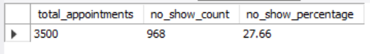
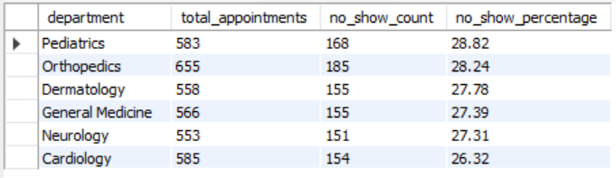
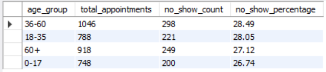
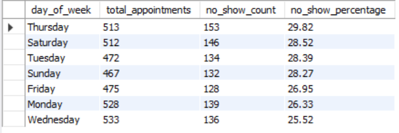
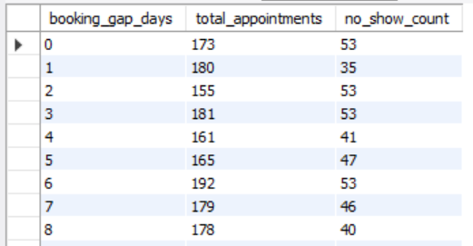
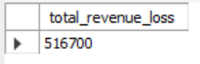
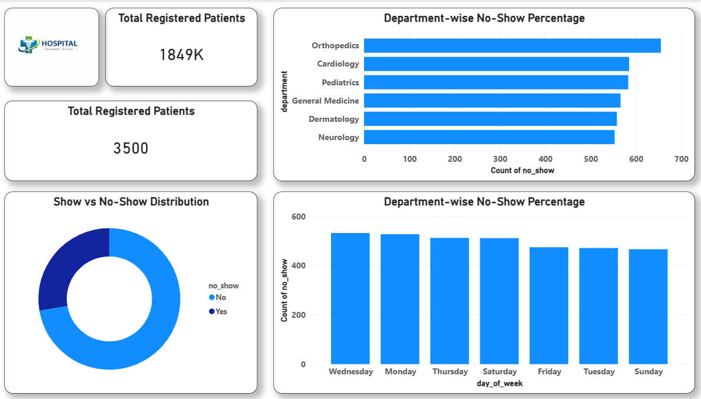
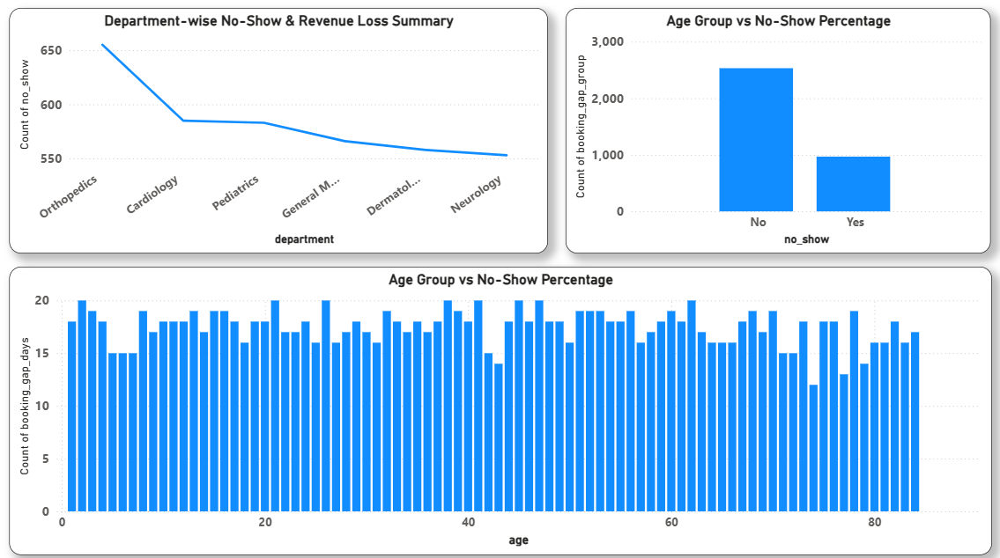

# 🏥 Hospital Appointment No-Show Analytics

## 📌 Project Overview
This project analyzes hospital appointment data to identify patient no-show patterns and estimate revenue loss. The goal is to help healthcare facilities optimize scheduling, reduce no-shows, and improve operational efficiency.

---

## ❓ Business Problem
Hospitals face significant losses when patients fail to attend scheduled appointments without prior notice. This leads to:
- Doctor time wastage
- Revenue loss
- Reduced patient satisfaction

This project uses data analytics to uncover no-show trends and support data-driven decision-making.

---

## 🏗️ Project Architecture
**Flow:**

CSV Dataset  
↓  
Data Cleaning & Validation  
↓  
MySQL Database  
↓  
SQL Analysis  
↓  
Power BI Dashboard & Insights  

---

## 📊 Dataset Information
- **Source:** Simulated hospital appointment data  
- **Records:** 3500+ appointments  
- **Key Columns:**
  - patient_id
  - age
  - gender
  - department
  - booking_date
  - appointment_date
  - no_show
  - consultation_fee

---

## 🛠️ Tools & Technologies
- MySQL (SQL)
- Power BI
- VS Code
- Git & GitHub

---

## 🔍 SQL Analysis Performed
- Total appointments & no-show percentage
- Department-wise no-show analysis
- Age group & day-wise trends
- Booking gap impact on no-shows
- Revenue loss calculation

---

## 📸 SQL Output Screenshots

### 1️⃣ Total Appointments & No-Show %

### 2️⃣ Department-wise No-Show

### 3️⃣ Age Group Analysis

### 4️⃣ Day-wise Trend

### 5️⃣ Booking Gap vs No-Show

### 6️⃣ Revenue Loss

---

## 📊 Power BI Dashboard

### Dashboard – Overview

---

## 💡 Key Insights
1️⃣ Many Appointments Are Missed

A large number of patients do not come for their scheduled appointments. This wastes doctor time and reduces hospital revenue.

2️⃣ Some Departments Have More Missed Appointments

Orthopedics, Cardiology, and Pediatrics have the highest missed appointments. These departments need more reminders and better scheduling.

3️⃣ Weekdays Have More No-Shows Than Weekends

More patients miss appointments on Monday and Wednesday. Sunday appointments have fewer no-shows because patients are free from work.

4️⃣ Working People Miss More Appointments

Patients between 25–55 years miss more appointments due to job and time pressure. Older patients attend appointments more regularly.

5️⃣ Long Waiting Time Increases No-Shows

When appointments are booked many days in advance, patients are more likely to forget or cancel. Shorter booking gaps reduce no-shows.

---

## 🚀 Future Improvements
1️⃣ Send Appointment Reminders

Send SMS / WhatsApp reminders 1 day and 2 hours before appointments so patients don’t forget.

2️⃣ Reduce Long Waiting Time

Avoid booking appointments too far in advance and re-confirm old bookings to reduce missed visits.

3️⃣ Improve Scheduling on High No-Show Days

Adjust schedules on Monday and Wednesday and promote Sunday appointments to balance patient flow.

---

## 👤 Author
**Krushna Pawar**

